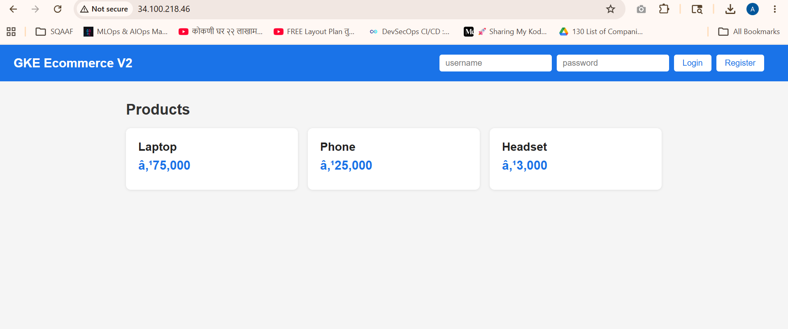
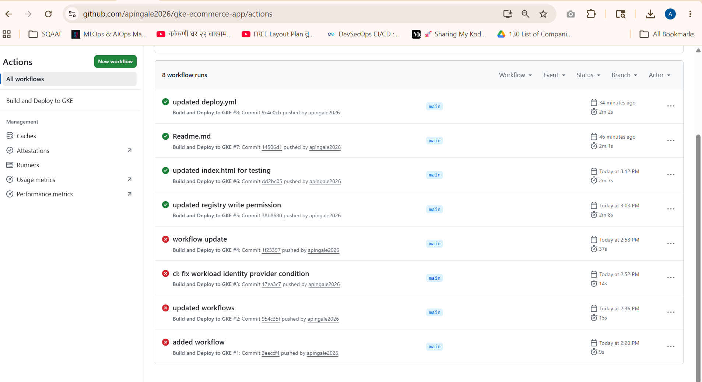
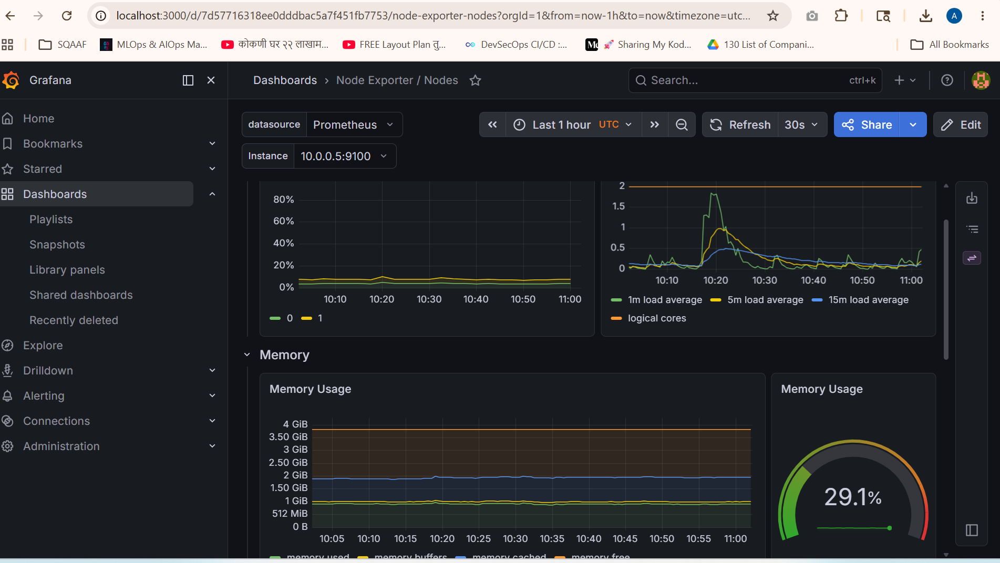

# 🚀 GKE Ecommerce Platform

A production-grade microservices e-commerce application deployed on Google Kubernetes Engine (GKE) using modern DevOps practices.

---

## 📌 Overview

This project demonstrates a complete DevOps pipeline for a microservices application:
- **Infrastructure as Code** using Terraform with reusable modules
- **Containerized microservices** deployed on GKE
- **GitOps-style deployment** using Helm charts
- **Automated CI/CD** using GitHub Actions with Workload Identity Federation
- **Full observability** with Prometheus and Grafana

---

## 🏗️ Architecture

```
Developer
    ↓ git push
GitHub Repository
    ↓ triggers
GitHub Actions CI/CD
    ↓ builds & pushes
Artifact Registry (Docker Images)
    ↓ deploys via Helm
GKE Cluster (3 nodes, asia-south1)
    ├── namespace: frontend
    │   └── Frontend (Nginx + HTML)
    ├── namespace: backend
    │   ├── Product API (Python Flask)
    │   └── Auth Service (Node.js)
    └── namespace: monitoring
        ├── Prometheus
        ├── Grafana
        └── Alertmanager
            ↓ connects to
GCP Managed Services
    ├── Cloud SQL (Postgres 15, Private IP)
    ├── Secret Manager
    └── Artifact Registry
```

---

## 🛠️ Tech Stack

| Category | Technology |
|---|---|
| Cloud Provider | Google Cloud Platform (GCP) |
| Container Orchestration | Google Kubernetes Engine (GKE) |
| Infrastructure as Code | Terraform |
| Package Manager | Helm |
| CI/CD | GitHub Actions |
| Container Registry | GCP Artifact Registry |
| Database | Cloud SQL (PostgreSQL 15) |
| Monitoring | Prometheus + Grafana + Alertmanager |
| Authentication | Workload Identity Federation (keyless) |
| Secret Management | GCP Secret Manager |
| Frontend | HTML + JavaScript + Nginx |
| Product API | Python Flask |
| Auth Service | Node.js Express |

---

## 📁 Project Structure

```
gke-ecommerce-platform/
├── terraform/
│   ├── modules/
│   │   ├── vpc/          ← VPC, Subnets, NAT, Firewall
│   │   ├── gke/          ← GKE Cluster, Node Pool
│   │   ├── cloudsql/     ← PostgreSQL, Private IP
│   │   ├── iam/          ← Service Accounts, Workload Identity
│   │   └── registry/     ← Artifact Registry
│   └── environments/
│       ├── dev/          ← 1 node, db-f1-micro
│       ├── staging/      ← 2 nodes, db-g1-small
│       └── prod/         ← 3 nodes, HA SQL
├── services/
│   ├── frontend/         ← Nginx + HTML app
│   ├── product-api/      ← Python Flask REST API
│   └── auth-service/     ← Node.js JWT auth
├── helm/
│   ├── frontend/         ← Helm chart
│   ├── product-api/      ← Helm chart
│   └── auth-service/     ← Helm chart
├── k8s/
│   └── namespaces.yaml   ← frontend, backend, monitoring
└── .github/
    └── workflows/
        └── deploy.yml    ← CI/CD pipeline
```

---

## ✨ Features

- **3 Microservices** — Frontend, Product API, Auth Service
- **3 Environments** — Dev, Staging, Prod with separate state files
- **Reusable Terraform Modules** — write once, use across environments
- **Helm Charts** — templated K8s manifests with configurable values
- **HPA** — Horizontal Pod Autoscaler on all services
- **RBAC** — Role-based access control per namespace
- **Network Policies** — deny-all with explicit allow rules
- **Workload Identity** — no service account key files anywhere
- **Private Cloud SQL** — no public IP, accessible only within VPC
- **Secret Manager** — DB credentials stored securely
- **Automated Pipeline** — git push triggers full build + deploy
- **Full Observability** — Prometheus metrics, Grafana dashboards

---

## ✅ Prerequisites

```bash
# Tools needed
gcloud CLI
terraform >= 1.6
kubectl
helm >= 3
docker
```

---

## 🏗️ Infrastructure Setup

### Step 1 — Authenticate to GCP
```bash
gcloud auth login
gcloud auth application-default login
gcloud config set project YOUR_PROJECT_ID
```

### Step 2 — Create GCS bucket for Terraform state
```bash
gsutil mb -l asia-south1 gs://YOUR_BUCKET_NAME
gsutil versioning set on gs://YOUR_BUCKET_NAME
```

### Step 3 — Deploy dev infrastructure
```bash
cd terraform/environments/dev
export TF_VAR_db_password="YOUR_PASSWORD"
terraform init
terraform plan
terraform apply
```

### Step 4 — Connect kubectl to GKE
```bash
gcloud container clusters get-credentials CLUSTER_NAME \
  --region asia-south1 \
  --project YOUR_PROJECT_ID
```

---

## 🚀 Application Deployment

### Step 1 — Create namespaces
```bash
kubectl apply -f k8s/namespaces.yaml
```

### Step 2 — Authenticate Docker
```bash
gcloud auth configure-docker asia-south1-docker.pkg.dev
```

### Step 3 — Build and push images
```bash
docker build -t REGISTRY/PROJECT/REPO/frontend:v1 ./services/frontend
docker build -t REGISTRY/PROJECT/REPO/product-api:v1 ./services/product-api
docker build -t REGISTRY/PROJECT/REPO/auth-service:v1 ./services/auth-service

docker push REGISTRY/PROJECT/REPO/frontend:v1
docker push REGISTRY/PROJECT/REPO/product-api:v1
docker push REGISTRY/PROJECT/REPO/auth-service:v1
```

### Step 4 — Deploy with Helm
```bash
helm install frontend ./helm/frontend -n frontend
helm install product-api ./helm/product-api -n backend
helm install auth-service ./helm/auth-service -n backend
```

### Step 5 — Install monitoring
```bash
helm repo add prometheus-community https://prometheus-community.github.io/helm-charts
helm install monitoring prometheus-community/kube-prometheus-stack -n monitoring --create-namespace
```

### Step 6 — Verify
```bash
kubectl get pods -n frontend
kubectl get pods -n backend
kubectl get pods -n monitoring
```

---

## 🔄 CI/CD Pipeline

### Pipeline Flow
```
git push to main
      ↓
GitHub Actions triggers
      ↓
Authenticate to GCP (Workload Identity Federation — no keys!)
      ↓
Build Docker images (tagged with commit SHA)
      ↓
Push to Artifact Registry
      ↓
helm upgrade on GKE (rolling deployment)
      ↓
Verify all pods running
```

### Workload Identity Federation Setup
```bash
# Create pool
gcloud iam workload-identity-pools create "github-pool" \
  --location="global"

# Create provider
gcloud iam workload-identity-pools providers create-oidc "github-provider" \
  --workload-identity-pool="github-pool" \
  --attribute-mapping="google.subject=assertion.sub,attribute.repository=assertion.repository" \
  --attribute-condition="assertion.repository=='YOUR_GITHUB_USERNAME/gke-ecommerce-app'" \
  --issuer-uri="https://token.actions.githubusercontent.com"
```

### Key Security Features
- ✅ No service account key files
- ✅ Short-lived tokens (auto-expire)
- ✅ Scoped to specific GitHub repository
- ✅ Principle of least privilege (only 2 IAM roles)

---

## 📊 Monitoring

### Access Grafana
```bash
# Get password
kubectl get secret monitoring-grafana -n monitoring \
  -o jsonpath="{.data.admin-password}" | base64 -d

# Port forward
kubectl port-forward svc/monitoring-grafana 3000:80 -n monitoring

# Open browser
http://localhost:3000 (admin / password from above)
```
#Screenshots
### Application


### CI/CD Pipeline


### Grafana Dashboard


---

## 🌍 Environments

| Environment | Nodes | Machine Type | DB Tier | Use |
|---|---|---|---|---|
| dev | 1 | e2-medium | db-f1-micro | Development |
| staging | 2 | e2-medium | db-g1-small | Pre-prod testing |
| prod | 3 | e2-standard-2 | db-custom-2-4096 | Production |

Each environment has:
- Separate GKE cluster
- Separate Cloud SQL instance
- Separate Artifact Registry
- Separate Terraform state file in GCS

---

## 💰 Cost Management

```bash
# Destroy when not in use
cd terraform/environments/dev
terraform destroy

# Rebuild when needed (takes ~15 min)
terraform apply
```


